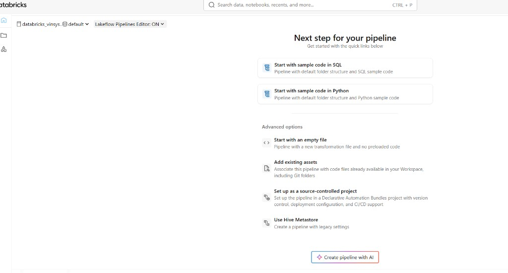
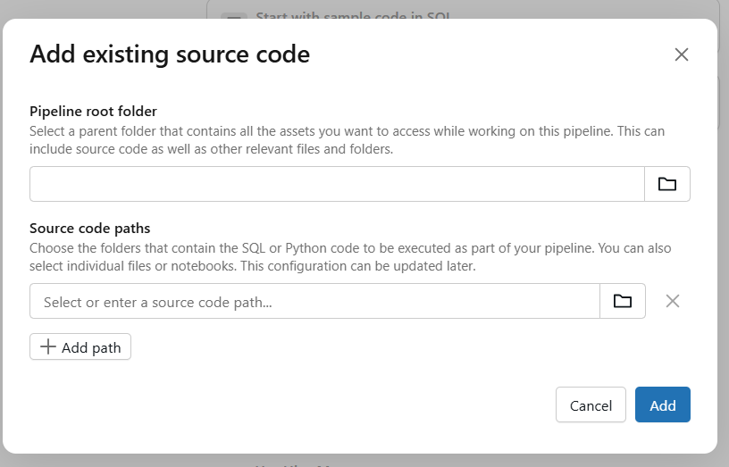

# Deploying a Lakeflow ETL Pipeline (Azure Databricks, Unity Catalog)

These Python modules are **libraries** for an **ETL Pipeline** (Lakeflow). They use the **`pyspark.pipelines`** API (`from pyspark import pipelines as dp`), which is what current Lakeflow Spark Declarative Pipelines expect—the older standalone `dlt` import is deprecated on Databricks. They declare medallion datasets (bronze, silver, gold) with expectations. Pipeline outputs are registered in **Unity Catalog** according to the **catalog and schema** you choose in the workspace UI—do not embed destination catalog or schema names in the source files.

Use a **Databricks Runtime** (or serverless environment) that supports Lakeflow SDP with `pyspark.pipelines` (see [Python language reference](https://docs.databricks.com/en/dlt-ref/python-ref)).

## Create the pipeline

### 1. Open the pipeline creator

Use **Create** (or **+ New**) → **ETL Pipeline**. The UI may also describe this as a **Lakeflow** pipeline; both refer to the same declarative ETL product.

### 2. Lakeflow Pipelines Editor

If you see **Lakeflow Pipelines Editor**, leave it **ON**. That enables the multi-file editor and matches how you attach several `.py` libraries for this lab.

### 3. “Next step for your pipeline”

After the first screens, Databricks shows quick links to get started. A typical workspace looks like this:

Use this table to pick the right option for **this course**:

| Option | Use in this lab? |
|--------|------------------|
| **Start with sample code in SQL** | No — our medallion code is Python. |
| **Start with sample code in Python** | Optional curiosity only; the training files are the three `lakeflow_*.py` modules in this repo. |
| **Start with an empty file** | Acceptable if you then **add** our three library files as pipeline sources (same outcome as below). |
| **Add existing assets** | **Recommended.** Associate the pipeline with `.py` files already in **Workspace** or a **Git folder** (Repo), e.g. `hands-on/day-07/pipelines/lakeflow_bronze_flights.py`, `lakeflow_silver_flights.py`, `lakeflow_gold_flights.py`. |
| **Set up as a source-controlled project** | For **Databricks Asset Bundles** and CI/CD-style projects — not required for the classroom exercise. |
| **Use Hive Metastore** | Legacy storage; prefer **Unity Catalog** in pipeline settings (see below). |
| **Create pipeline with AI** | Skip for the structured lab; use the provided modules so steps match the instructor and docs. |

Complete any prompts for pipeline **name**, **catalog**, or **schema** that appear before or after this screen (wording varies by workspace version).

### 4. “Add existing source code” modal (after **Add existing assets**)

Choosing **Add existing assets** opens a dialog like this:

Fill it in as follows for this course.

#### Pipeline root folder

- Pick the **parent folder** that contains the pipeline Python files (and anything else you want the editor to treat as part of this pipeline’s workspace).
- **Typical choice:** the folder that already holds `lakeflow_bronze_flights.py` in your clone — in the repo that is  
  `hands-on/day-07/pipelines`  
  (under your **Repo** or **Workspace** path, e.g. `/Repos/<user>/<repo>/hands-on/day-07/pipelines`).
- Use the **folder** icon to browse; do not paste a URL. The exact prefix depends on whether you use **Repos**, **Workspace** upload, or a shared team path.

#### Source code paths

- These rows are the **SQL or Python** (or notebooks) that define the pipeline’s datasets. You can change this later in the pipeline settings.
- **Recommended (explicit):** add **three** entries via **Add path** (one per file):
  1. `lakeflow_bronze_flights.py`
  2. `lakeflow_silver_flights.py`
  3. `lakeflow_gold_flights.py`  
  Browse to each file with the folder icon, or enter the path that matches your workspace layout.
- **Alternative:** if the UI lets you select the **`pipelines`** folder as a single source path and your workspace includes every `.py` file there, one folder path can be enough — but if only some files run, prefer listing the **three files** above so bronze → silver → gold are all in scope.

Click **Add** to confirm. **Cancel** discards the modal without linking assets.

#### Optional fourth module

- For Auto Loader bronze only, add **`lakeflow_bronze_cloudfiles_ingestion.py`** as another source path (and use **Continuous** mode; see below). Do not mix batch and streaming bronze in one pipeline unless you intend two bronze tables.

### 5. Confirm libraries in the editor

After the modal, the **Lakeflow Pipelines Editor** should list the same Python modules as pipeline sources. If anything is missing, use the pipeline’s **edit sources** / **add file** flow (wording varies) to align with:

- `lakeflow_bronze_flights.py`
- `lakeflow_silver_flights.py`
- `lakeflow_gold_flights.py`

If you started from a sample or empty file instead of **Add existing assets**, remove sample code you do not need and add the three files above the same way.

### 6. Pipeline settings (edition, mode, storage, compute)

1. **Edition:** choose **Advanced** when you need full expectation reporting and related features.

2. **Mode**
   - **Triggered** — default for the batch medallion path: `lakeflow_bronze_flights.py` → `lakeflow_silver_flights.py` → `lakeflow_gold_flights.py`.
   - **Continuous** — use when you attach `lakeflow_bronze_cloudfiles_ingestion.py` (streaming ingest with Auto Loader).

3. **Storage**
   - Select **Unity Catalog** as the pipeline storage model (avoid **Hive Metastore** unless your environment requires legacy mode).
   - Set **destination catalog** and **schema**. Logical names in code are `bronze_flights`, `silver_flights`, and `gold_flights`; published names become `<catalog>.<schema>.<table>`.

4. **Compute**
   - Prefer **Serverless** where the workspace supports it. Otherwise use the pipeline compute option your administrator assigns.

## Configuration keys

| Key | Purpose |
|-----|---------|
| `bronze.source.delta.path` | Source Delta path for batch bronze (abfss). |
| `bronze.cloudfiles.inbox` | Landing path for optional Auto Loader bronze. |
| `bronze.cloudfiles.schemaLocation` | Schema and evolution metadata path for Auto Loader. |

## Expectations

Table and view functions use pipeline **expectation** decorators: log-only checks on bronze and silver, **drop violating rows** on gold for the sample rule. For a hard stop on any violation, switch the gold rule to the **fail-the-update** style decorator (see comments in `lakeflow_gold_flights.py`).

## Ingestion

- **Batch Delta:** `lakeflow_bronze_flights.py` reads an existing Delta path; that data may come from Lakeflow Ingestion, jobs, or other pipelines.
- **Raw files:** `lakeflow_bronze_cloudfiles_ingestion.py` uses Auto Loader (`cloudFiles`) against abfss or UC-accessible paths.

## Run and verify

Start the pipeline, then use **Lineage** and **Expectations** in the UI. After code changes, use **Refresh** or **Full refresh** as needed.

## Troubleshooting

| Symptom | What to check |
|---------|----------------|
| Cannot read source Delta | Pipeline identity can **read** `bronze.source.delta.path`. |
| Missing upstream table | All three default libraries are on the **same** pipeline; the bronze **function name** must match what silver reads. |
| Permission errors on write | UC grants for the pipeline identity on the target catalog/schema. |
| Stuck or queued runs | **Events**; cancel duplicate runs. |
| Empty gold after run | Expectation dropped rows; validate silver data and the gold rule. |
| Stale results | Run **Full refresh** once after logic changes. |
